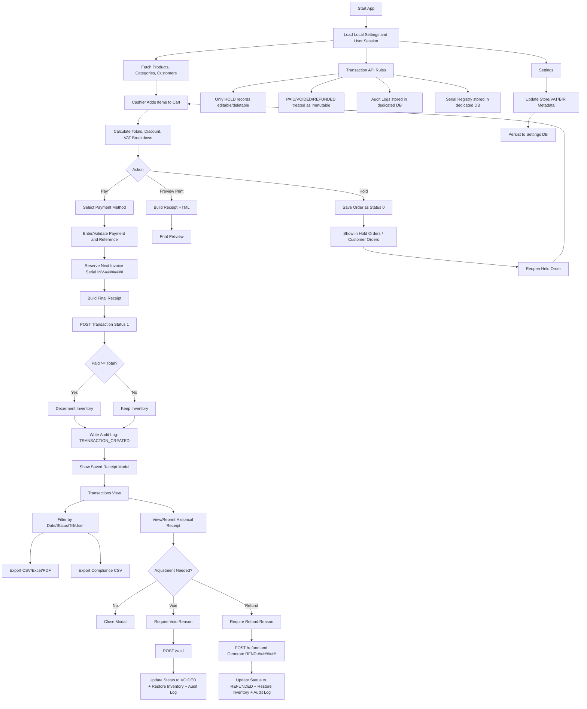

# Store POS System Flow

```mermaid
flowchart TD
    A[Start App] --> B[Load Local Settings and User Session]
    B --> C[Fetch Products, Categories, Customers]
    C --> D[Cashier Adds Items to Cart]
    D --> E[Calculate Totals, Discount, VAT Breakdown]
    E --> F{Action}

    F -->|Hold| G[Save Order as Status 0]
    G --> H[Show in Hold Orders / Customer Orders]

    F -->|Preview Print| I[Build Receipt HTML]
    I --> J[Print Preview]

    F -->|Pay| K[Select Payment Method]
    K --> L[Enter/Validate Payment and Reference]
    L --> L1[Reserve Next Invoice Serial INV-########]
    L1 --> M[Build Final Receipt]
    M --> N[POST Transaction Status 1]
    N --> O{Paid >= Total?}
    O -->|Yes| P[Decrement Inventory]
    O -->|No| Q[Keep Inventory]
    P --> R[Write Audit Log: TRANSACTION_CREATED]
    Q --> R
    R --> R1[Show Saved Receipt Modal]

    H --> S[Reopen Held Order]
    S --> D

    R1 --> T[Transactions View]
    T --> U[Filter by Date/Status/Till/User]
    U --> V[Export CSV/Excel/PDF]
    U --> V1[Export Compliance CSV]
    T --> W[View/Reprint Historical Receipt]

    W --> W1{Adjustment Needed?}
    W1 -->|No| W2[Close Modal]
    W1 -->|Void| X1[Require Void Reason]
    W1 -->|Refund| X2[Require Refund Reason]
    X1 --> X3[POST /void]
    X2 --> X4[POST /refund and Generate RFND-########]
    X3 --> X5[Update Status to VOIDED + Restore Inventory + Audit Log]
    X4 --> X6[Update Status to REFUNDED + Restore Inventory + Audit Log]

    B --> I1[Transaction API Rules]
    I1 --> I2[Only HOLD records editable/deletable]
    I1 --> I3[PAID/VOIDED/REFUNDED treated as immutable]
    I1 --> I4[Audit Logs stored in dedicated DB]
    I1 --> I5[Serial Registry stored in dedicated DB]

    B --> X[Settings]
    X --> Y[Update Store/VAT/BIR Metadata]
    Y --> Z[Persist to Settings DB]
```
